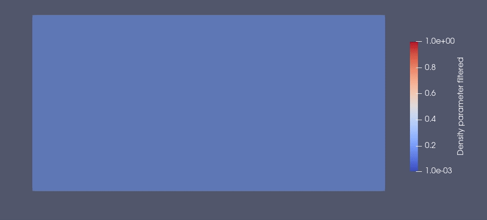

.. _your_first_optimization:

A first simple optimization using HydrOpTop
===========================================

Problem description
-------------------

Your first topology optimization problem consists in a classical benchmark test in linear mechanic, that is the cantilever. 
The design domain is a rectangle of 5 units high and 10 units wide discretized with triangles, where the cantilever is fixed at the left boundary and the load (unitary) applied at right bottom corner.
The 2D linear elasticity solver is used. 
The design domain is discretized in X triangles generated using `Salome <www.salome-platform.org>`_ CAD software.

The topology optimization is carried out by considering a parametrization of the Young modulus in each mesh triangle using a SIMP parametrization with a penalization power of 3.
A ball density filter with a radius of  is also applied to avoid the formation of checkerboard pattern and to apply a minimal size constraint of 0.3 units.
A volume constraint of 50% is considered.

The Python Code
---------------

.. literalinclude :: ../../examples/Cantilever_simple/make_cantilever_simple.py
   :language: python

Results
-------

Evolution of the cantilever was outputted every 2 iterations in vtu format, which can be visualized using Paraview software.

