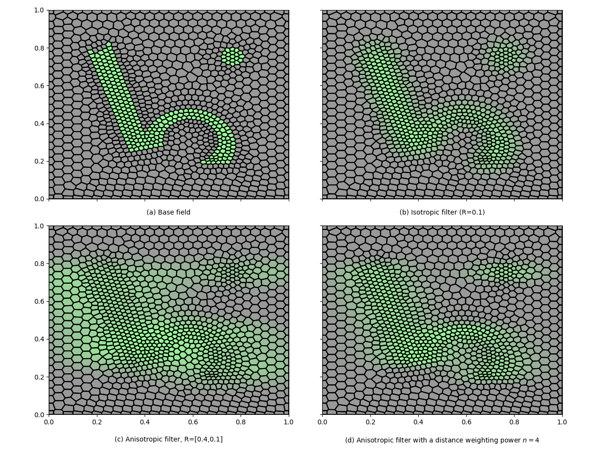
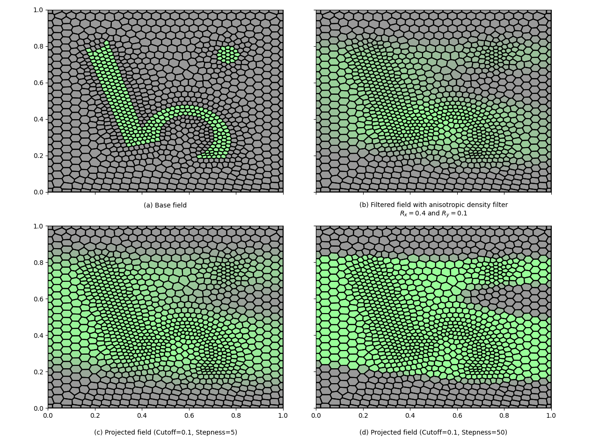

.. _filters:

Filter classes
==============

Smooth the density parameter `p` before to convert it to material properties.

Filtering can help the solver to better converge because it can delete 
large material property difference on neighbor cells, and to impose length
constrain on the optimisation.

Density filter
--------------

Smooth the density parameter `p` at a given cell `i` according to its value
at the neighboring cells `j` weighted by the distance of their respective 
centers:

.. math::
  :label: density_filter
  
  \bar{p}_i = \frac{R^n V_i p_i + \sum_{j \in \partial i} (R-d_{ij})^n V_j p_j}
                    {R^n V_i + \sum_{j \in \partial i} (R-d_{ij})^n V_j}
  
This filter was proposed by Bruns and Tortorelli (2001) and Bourdin (2001). 
Also see Xu et al. (2009).

Constructor is:

``Density_Filter(filter_radius, distance_weighting_power)``

where the argument ``filter_radius`` is the ball radius on which to search 
for neighboring cell center for averaging the density parameter and 
``distance_weighting_power`` the exponent for distance weighting :math:`n` 
(default 1, i.e. linear). When a list is provided for the filter radius (i.e.
``filter_radius=[dx,dy,dz]``), the cell centers are searched into a ellipsoid of 
half axis dx, dy and dz.

   Filtering the density parameter according to its nearby value: (a) the 
   density parameter, (b) filtered density parameter using a ball neighbors search, 
   (c) using an ellipsoid neighbors search and (d) increasing the weighting power 
   from 1 to 4.

Helmholtz Density filter
------------------------

Smooth the density filter using the Helmholtz partial differential equation:

.. math::
  :label: helmholtz_filter
  
  \nabla^T \boldsymbol{K} \: \nabla \bar p + \bar p = 0

This filter is doing approximately the same than the standard density filter above but
requires much less memory by not storing the distance matrix. Also more
robust when the optimization mesh had sharp concave boundary. 
More detail available in Lazarov and Sigmund (2011).

Not yet implementated, but planned...

Heavyside filter
----------------

Apply the smooth Heavyside function to the density parameter with a given
steepness and cutoff. Heavyside filters are usually applied on already filtered
field using the previous density filter to help impose a minimum length constrain
and to avoid blurry contour. The smooth Heavyside function is defined as:

.. math::
  :label: heavyside_filter
  
   \tilde{p}_i = \frac{\tanh(\beta \eta) + \tanh(\beta (\bar p - \eta))}
                      {\tanh(\beta \eta) + \tanh(\beta (1- \eta))}

Constructor is:

``Heavyside_Filter(base_density_filter, cutoff, steepness)``

``cutoff`` is the cutoff parameter :math:`\eta` (i.e. the value of 
:math:`p_i` where the step is located) and ``steepness`` the steepness
of the smooth Heavyside function :math:`\beta`. 
``base_density_filter`` is another density filter on whom apply the 
Heavyside filter, such as a basic ``Density_Filter(filter_radius)``, or ``None``
to apply it directly on the density parameter (not very common in practice).

Heavyside filter class comes with a specific method ``plot_filtered_density()``
allowing to visualize the transformation applied to the (filtered) density 
parameter.

   The three field filtering process: (a) the density parameter (1st field),
   (b) the filtered density parameter with a anisotropic density filter (2nd field), 
   and (c) and (d) the projected density parameter using two heavyside density filter
   with different stepness parameter (3rd field).

Volume preserving Heavyside filter
----------------------------------

TODO

A variation of the previous filter.
Apply the smooth Heavyside function to the density parameter with a given
steepness and cutoff according to (Xu et al. 2009):

.. math::
  :label: volume_preserving_heavyside_filter
  
  \tilde{p}_i = \left\{ 
            \begin{array}{ll}
       \eta \left[ e^{-\beta(1-\bar{p}_i/\eta)} - 
         (1-\frac{\bar{p}_i}{\eta}) e^{-\beta}\right] \quad \mbox{if} \quad \bar{p}_i<\eta \\
      (1-\eta) \left[ 1-e^{-\beta(\bar{p}_i-\eta)/(1-\eta)} + 
         \frac{\bar{p}_i-\eta}{1-\eta}e^{-\beta} \right] + \eta \quad \mbox{else}
            \end{array} \\
                \right.

Constructor is:

``Volume_Preserving_Heavyside_Filter(base_density_filter, cutoff, steepness)``

``cutoff`` is the cutoff parameter :math:`\eta` (i.e. the value of 
:math:`p_i` where the step is located) and ``steepness`` the steepness
of the smooth Heavyside function :math:`\beta`. 
``base_density_filter`` is another density filter on whom apply the 
Heavyside filter, such as a basic ``Density_Filter(filter_radius)``.

This filter was proposed by Xu et al. (2009). See the original publication
for more detail.

Reference
------------------------

Xu, Cai and Cheng (2009)

